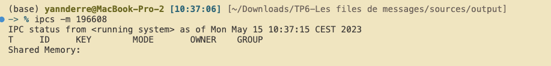
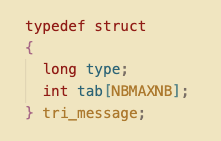

# SY40 TP6

## a) Compilez P1.c, P2.c, P3.c pour obtenir les exécutables P1, P2 et P3.

_Utilisation standard de GCC_

## b) Exécutez P1, puis réessayez une nouvelle fois. Comment expliquez-vous la réponse ?

Le programme ne supprime jamais la file de message créée : le programme ne s'exécutera qu'une seule fois sans la supprimer.

## c) Visualisez les tables du système et détruisez l\'entrée adéquate (ipcs, ipcrm), puis modifiez P1.c pour que la destruction de la file de messages soit automatique.

On trouve l'ID de la message queue via la commande ipcs, et on rajoute un msgctl pour supprimer l'ancienne fille. Le P1 s'exécute maintenant correctement  
   
 

On a supprimé les files de messages pré-existantes. On peut maintenant rajouter notre condition en fin de P1 pour supprimer sa file de message pour qu'il puisse automatiquement se réexecuter.

## d) Complétez P2.c et P3.c pour que les deux processus P2 et P3 s\'écrivent et lisent mutuellement leurs numéros de PID en utilisant la file de message créée par P1.

Dans P2, on envoie le type 2 à P3 et reçoit le type 3. Vice-versa dans P3.

  
 

## Ecrivez à partir de prg2.c un programme prg3.c comprenant un autre processus serveur (TRIEUR) qui trie les nombres aléatoires générés par le SERVEUR avant de les fournir au CLIENT.

  
   
 

J'ai déclaré une structure additionnelle pour envoyer mon message du serveur à la fonction de tri

  

On se charge également de créer nos message queues, et de gérer leur suppression lors de l'arrêt via Ctrl+C (SIGINT signal)

Côté serveur:  

Le serveur va copier la réponse des nombres générer du client dans une structure tri, créer un processus fils qui le triera dans la fonction tri(). Le serveur attend la réponse du fils.

Le fils appelant la fonction tri va se connecter à la message queue, via la clé prédéfinie. On peut maintenant appliquer notre tri croissant pour nos chiffres entiers générés via qsort, et la fonction ordreAscendantInt, fournie dans tri.c

Tri() renvoie ensuite dans la message queue pour réception par son père.

Ce dernier va ensuite le replacer dans une structure réponse, et le renvoyer à son client respectif (via son pidEmetteur) Bien que les structures req et tri_message soient identiques, j'ai préféré créer une autre structure. Elle nous permettrait de s'adapter plus facilement à d'autres contraintes, (e.g. conversion de types...) si nous devions les implémenter, bien que cela consomme davantage de mémoire à l'exécution. Dans notre cas d'utilisation. Nous pourrions nous contenter de réutiliser la même structure dans la message queue de tri.
